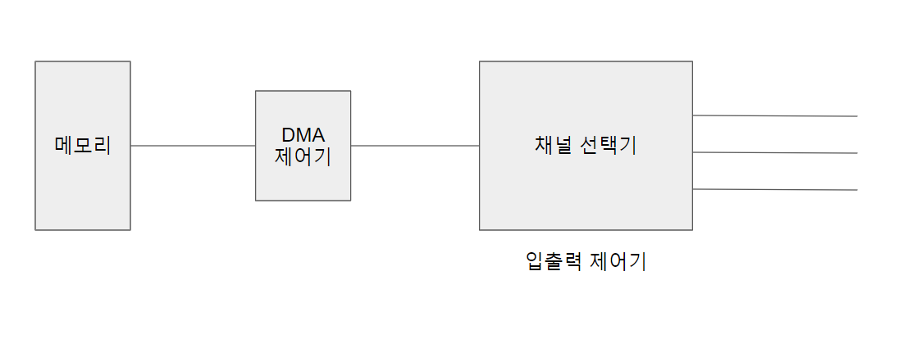
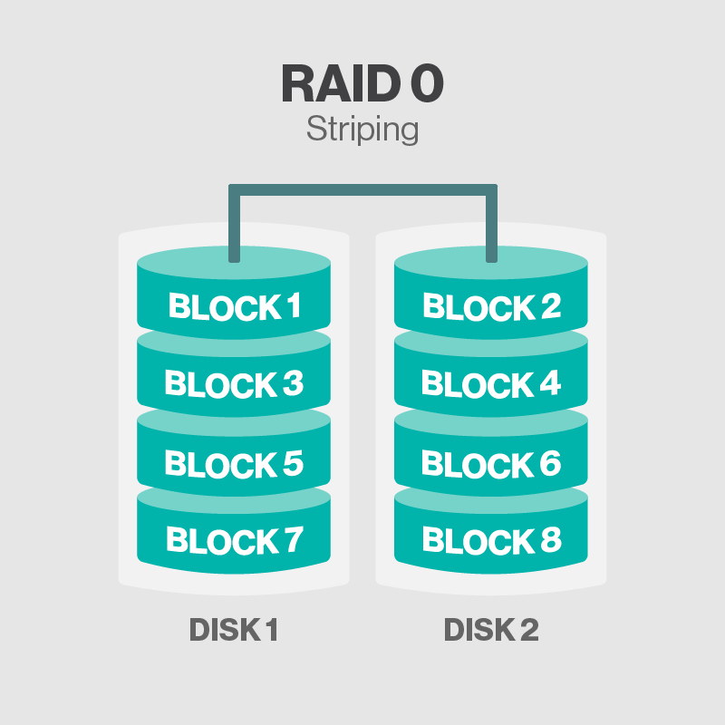
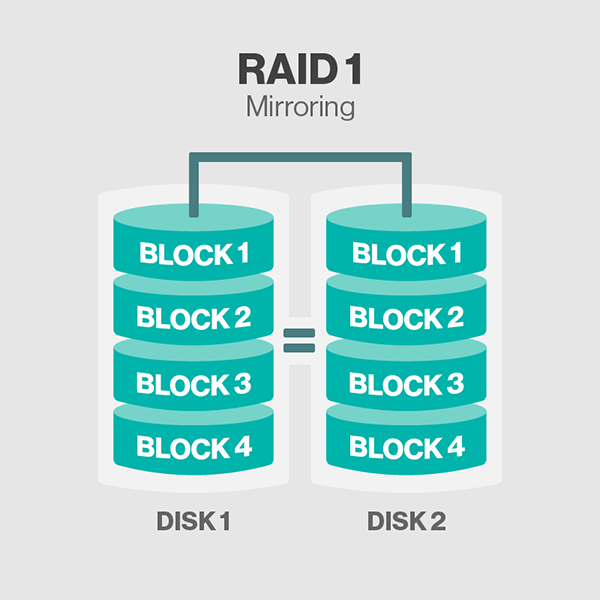
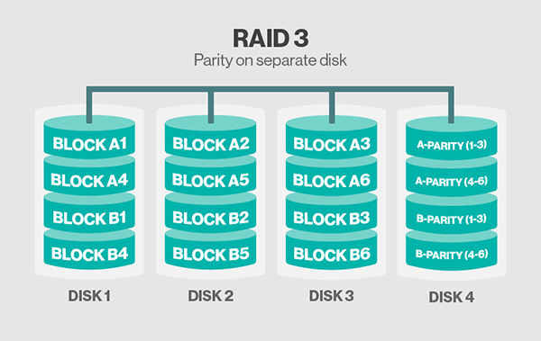
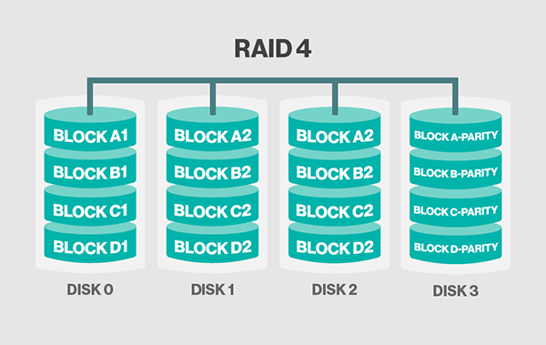
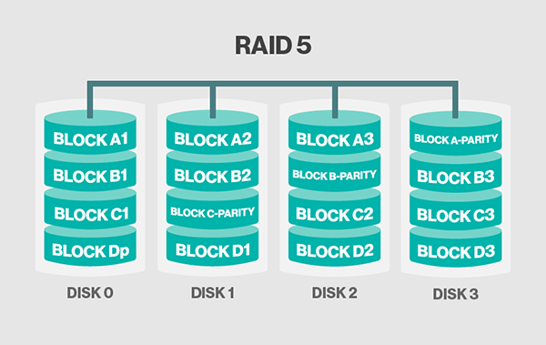

# 입출력 시스템과 디스크 관리

## 입출력 시스템

### 입출력 장치

컴퓨터에 각 장치는 메인보드에 있는 버스로 연결된다. 다양한 주변장치는 데이터 전송 속도에 따라 **저속 주변장치**와 **고속 주변장치**로 구분된다.

- **저속 주변장치**: 키보드, 마우스 같이 오고 가는 데이터의 양이 적어 데이터 전송률이 낮은 장치
- **고속 주변장치**: 그래픽카드, 하드디스크처럼 대용량 데이터가 오고 가 데이터 전송률이 높은 장치

### 입출력 버스의 구조

#### 폴링 방식

초기에는 CPU가 작업을 진행하다가 입출력 명령을 만나면 직접 입출력 장치에서 데이터를 가져왔는데 이를 폴링 방식이라고 한다.

- 폴링 방식: 하드웨어 상태를 수시로 체크하여 명령을 받을 수 있는지 확인

그러나 입출력 장치는 CPU와 메모리보다 매우 느리기 때문에 폴링 방식을 사용하면 CPU 대기 시간이 길어져 작업의 속도가 매우 느려진다.

#### 입출력 제어기를 사용한 구조

다양한 주변 장치가 나오고 폴링 방식의 한계 때문에 모든 입출력을 **입출력 제어기**에 맡기는 구조가 나왔다.

입출력 요청이 오면 입출력 제어기가 입출력 장치로부터 데이터를 직접 송수신한다. 이로인해 CPU와 메모리의 작업이 느려지는 것을 막을 수 있어 전체 작업 효율이 향상된다.

또한 입출력 버스를 고속 입출력 버스와 저속 입출력 버스로 분리해서 운영한다. (두 버스 사이의 데이터 전송은 채널 선택기가 관리)

### 직접 메모리 접근

직접 메모리 접근(DMA)은 CPU의 도움 없이 메모리에 접근할 수 있도록 입출력 제어기에 부여된 권한이다.

입출력 제어기의 채널 선택기가 여러 채널에서 전송 받은 데이터 중 어떤 것을 메모리로 보낼지 정하고 DMA 제어기를 거쳐 메모리에 올라간다.

반대로 메모리에서 주변장치로 데이터를 전송할 때는 DMA 제어기가 메모리에서 데이터를 가져오면 채널 선택기에서 적당한 채널로 전송한다.

### 인터럽트

인터럽트는 입출력 제어기가 주변장치의 입출력 요구나 하드웨어 이상 현상을 CPU에 알려주는 역할을 하는 신호다.

ex) CPU가 요청 한 작업을 완료했을 때, 키보드로 데이터를 입력받았을 때, 네트워크 카드에 새로운 데이터가 도착했을 때, 하드웨어에 이상이 생겼을 때 등

- 외부 인터럽트: 입출력 및 하드웨어 관련 인터럽트
- 내부 인터럽트: 프로세스의 오류로 발생하는 인터럽트
- 시그널: 사용자의 요청으로 발생하는 인터럽트(리눅스에서 ctrl + c)

### 버퍼링

버퍼는 속도가 다른 두 장치의 속도 차이를 완화하는 역할을 한다. 입출력 장치는 느린 장치를 통해 들어오는 데이터를 버퍼에 모아 한꺼번에 이동시켜 느린 속도를 보완한다.

 이 때 단일 버퍼 대신 이중 버퍼를 사용하여 한 버퍼는 데이터를 담는 용도로 쓰고 다른 버퍼는 데이터를 가져가는 용도로 쓴다.

## 디스크 관리

### 하드 디스크 구조

- 섹터: 하드디스크의 가장 적은 저장 단위
- 트랙: 플래터에서 회전축을 중심으로 데이터가 기록되는 동심원(섹터의 집합)
- 실린더: 여러 개의 플래터에 있는 같은 트랙의 집합
- 헤드: 데이터를 읽거나 쓸 때 사용하는 부위

### 디스크의 데이터 전송 시간

- 탐색 시간: 헤드가 특정 섹터의 트랙까지 이동하는데 걸리는 시간
- 회전 지연 시간: 플래터가 회전하여 원하는 섹터를 만날 때 까지 걸리는 시간
- 전송 시간: 헤드가 섹터에 있는 데이터를 읽어 전송하는 시간

데이터 전송 시간 = 탐색 시간 + 회전 지연 시간 + 전송 시간

### 디스크 스케줄링

데이터 전송 시간 중 보통 탐색 시간에서 소모가 제일 커 디스크 스케줄링으로 트랙의 이동을 최소화 해야한다.

#### FCFS 디스크 스케줄링

- 가장 단순한 디스크 스케줄링 방식으로, 요청이 들어온 트랙 순서대로 서비스

#### SSTF(Shortest Seek Time First) 디스크 스케줄링

- 현재 헤드가 있는 위치에서 가장 가까운 트랙부터 서비스
- 만약 다음에 서비스할 두 트랙의 거리가 같다면 먼저 요청받는 트랙을 서비스
- 효율성은 좋지만 아사 현상을 일으킬 수 있음. 헤드가 중간에 위치하면 가장 안쪽이나 바깥쪽에 갈 확률이 적어짐

#### 블록 SSTF 스케줄링

- 위의 공평성 위배를 어느 정도 해결한 방법
- 블록 단위로 트랙을 관리하여 멀리 있는 트랙도 몇 번만 양보하면 서비스 받을 수 있음(에이징 적용)
- FCFS 보다 성능이 좋지 않음

#### SCAN 디스크 스케줄링

- SSTF의 공평성 위배 문제를 완화하기 위해 만들어진 기법
- 헤드가 한 방향으로만 움직이며 서비스를 함. 맨 마지막 트랙에 도착할 때까지 뒤돌아가지 않음
- SSTF 보다 성능이 조금 떨어지지만 FCFS 보다 성능이 좋음
- 가장 많이 사용되는 기법 중 하나. 그러나 동일한 트랙의 요청이 연속적으로 발생되면 헤드가 더 이상 나아가지 못해 바깥쪽 트랙이 아사 현상을 겪는 문제 발생

#### C-SCAN 디스크 스케줄링

- SCAN 스케줄링처럼 한 방향으로 움직이며 서비스 하지만 마지막 트랙에 도착하면 다시 처음으로 돌아감
- 모든 트랙이 공평하게 서비스 받음. 그러나 작업 없이 헤드를 이동하여 매우 비효율적

#### LOOK 디스크 스케줄링

- 더 이상 서비스할 트랙이 없으면 헤드가 끝가지 가지 않고 중간에서 방향을 바꿈

#### C-LOOK 디스크 스케줄링

- C-SCAN의 LOOK 버전

#### SLTF(Shortest Latency Time First) 디스크 스케줄링

- 최소 지연 우선 기법(헤드 이동 시간이 아닌 회전 지연 시간을 최적화)
- 작업 요청이 들어온 섹터의 순서를 디스크가 회전하는 방향에 맞추어 다시 정렬

### RAID(Redundant Array of Inexpensive/Independent Disk)

- 자동으로 백업을 하고 장애가 발생하면 이를 복구하는 시스템
- 원본 디스크와 같은 내용을 백업 디스크에 저장(미러링)하고 하나의 디스크가 고장날 시 다른 디스크를 사용해 데이터를 복구
- 여러 디스크에 데이터를 동시에 저장하며 입출력 속도를 높이는 방식도 있음

#### RAID 0(스트라이핑)

- 디스크를 병렬로 연결하여 여러 개의 데이터를 여러 디스크에 동시에 저장하거나 가져올 수 있음
- N개의 디스크로 구성된 RAID 0은 1개의 디스크로 구성된 시스템보다 약 N배 빠름
- 장애 발생 시 복구하는 기능이 없음
- 따라서 속도는 증가하지만 안정성은 낮아짐

#### RAID 1(미러링)

- 같은 데이터를 2개의 디스크에 저장(백업)
- 장애 발생시 미러링된 디스크를 활용하여 데이터를 복구할 수 있음
- 그러나 비용이 증가하고 속도가 느려짐(같은 내용을 두 번 저장하기 때문)

#### RAID 2

- 오류 교정 코드(ECC)를 따로 관리하여 오류가 발생하면 디스크를 복구
- 비트 단위로 여러 개의 디스크에 나누어 저장
- n개의 디스크에 대해 오류 교정 코드를 저장하기 위한 n-1개의 추가 디스크 필요
- 오류 교정 코드를 계산하는데 시간을 소비
- 잘 사용되지 않음

#### RAID 3

- 바이트 단위로 데이터를 나누어 저장
- 오류 검출 코드인 패리티를 사용하여 데이터를 복구.
짝수 패리티 혹은 홀수 패리티를 사용하여 장애가 난 비트를 추정
- 4개의 디스크당 1개 정도의 추가 디스크 필요
- 패리티 비트를 구성하는 데 시간을 소비
데이터를 읽거나 쓸 때 패리티 비트를 구성하기 위해 모든 디스크가 동시에 동작해야 함

#### RAID 4

- RAID 3와 같은 방식이지만 블록 단위로 데이터를 나누어 저장
- 데이터가 저장되는 디스크와 패리티 비트가 저장되는 디스크만 동작

#### RAID 5

- 패리티비트를 여러 디스크에 분산하여 구성
- 병목 현상 완화
- 패리티 비트가 있는 디스크가 고장나도 복구 가능

#### RAID 6

- RAID 5와 같은 방식이지만 패리티 비트가 2개
- RAID 5와 달리 디스크 2개가 동시에 장애가 발생했을 때도 복구 가능
- 패리티 비트를 2개씩 운영해서 부담이 커짐

#### RAID 10

- 미러링 기능을 가진 RAID 1과 빠른 데이터 전송이 가능한 RAID 0을 결합한 형태
- RAID 01과 달리 일부 디스크만 중단하여 복구 가능

#### RAID 50 or 60

- RAID 5 또는 6으로 묶은 두 쌍을 다시 RAID 0으로 묶어 사용

> Reference
> - 쉽게 배우는 운영체제 by 조성호
> - [https://chosh95.tistory.com/362](https://chosh95.tistory.com/362)
> - [https://danidanee.tistory.com/14](https://danidanee.tistory.com/14)
> - [https://woodforest.tistory.com/13](https://woodforest.tistory.com/13)
> - https://zetastring.tistory.com/121
