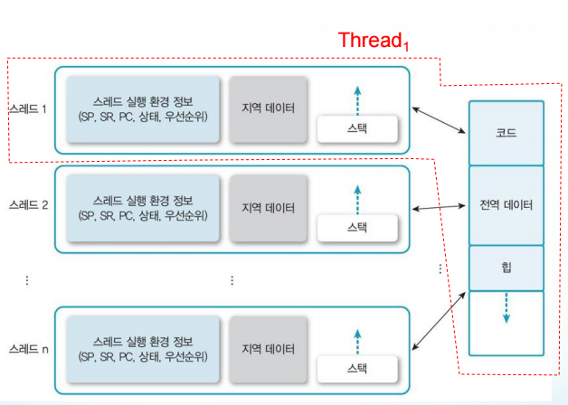
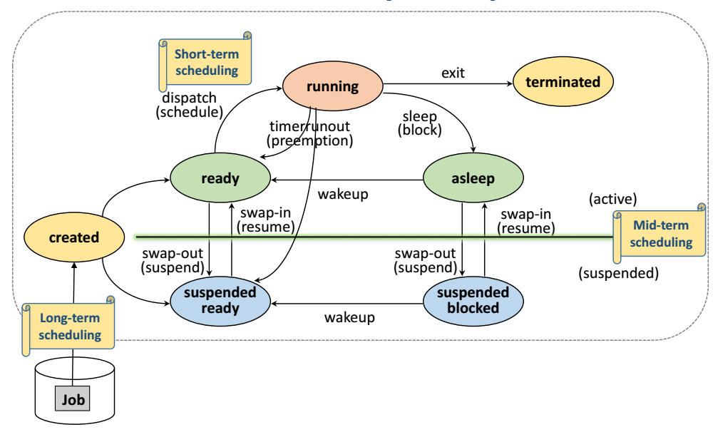
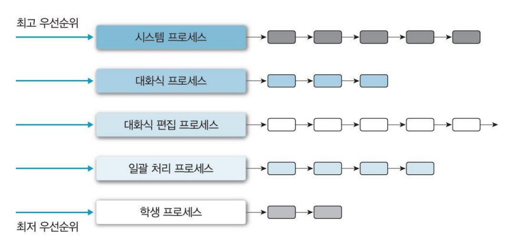

# 프로세스 vs 스레드, 멀티스레드, 스케줄러, CPU스케줄러

## 프로세스 vs 스레드

### 프로세스(Process)

**프로세스는 실행 중인 프로그램**으로 **디스크로부터 메모리에 적재되어 프로세서(CPU)의 할당을 받을 수 있는 것**을 의미합니다. 프로세스는 로컬 변수 등을 저장하는 스택 영역, 전역 변수를 저장하는 데이터 영역, 실행 중에 동적으로 할당되는 메모리인 힙 영역 등을 포함합니다.

프로세스의 생성과 동시에 **PCB(Process Control Block)**이 같이 생성됩니다. PCB는 프로세스 관리에 필요한 정보가 저장된 것으로 메모리의 운영체제 영역에 할당됩니다. PCB가 관리하는 정보는 다음과 같습니다.

- PID(Process Identification Number) : 프로세스 고유 식별 번호
- 스케줄링 정보 : 프로세스 우선순위 등과 같은 스케줄링 관련 정보
- 프로세스 상태 : 자원 할당, 요청 정보 등
- 메모리 관리 정보 : 페이지 테이블, 세그먼트 테이블 등
- 입출력 상태 정보 : 할당 받은 입출력 장치, 파일 등에 대한 정보 등
- 문맥 저장 영역(Context Save Area) : 프로세스의 레지스터 상태를 저장하는 공간 등
- 계정 정보 : 자원 사용 시간 등을 관리   

### 스레드(Thread)

프로세스는 자원을 할당받고 그 자원을 제어하여 원하는 작업을 수행합니다. 스레드는 자원의 할당과 제어에서 후자 부분을 떼어놓은 것입니다. 즉 **스레드는 프로세스의 실행 단위입니다**. 스레드는 스레드 ID, PC(Program Counter), 레지스터 집합, 스택으로 구성됩니다. 같은 프로세스에 속한 다른 스레드의 코드, 데이터, 힙 영역의 자원을 공유할 수 있습니다.   

Q. 스택을 스레드마다 독립적으로 할당하는 이유?

A. 스택은 함수 호출 시 전달되는 인자, 되돌아갈 주소값 및 함수 내에서 선언하는 변수 등을 저장하기 위한 공간입니다. 스택 메모리 공간이 독립적이라는 것은 독립적인 함수 호출이 가능하다는 의미이고, 이는 독립적인 실행 흐름이 추가 되는 것을 의미합니다. 따라서 스레드의 정의에 따라 독립적인 실행 흐름을 추가하기 위한 최소 조건으로 독립된 스택을 할당합니다.   

Q. PC Register를 스레드마다 독립적으로 할당하는 이유?

A. PC값은 스레드가 명령어의 어디까지 수행하였는지를 저장합니다. 스레드는 CPU를 할당받았다가 스케줄러에 의해 다시 선점 당하므로 명령어가 연속적으로 수행되지 못합니다. 따라서 어느 부분까지 수행되었는지 기억할 필요가 있기 때문에 PC Register를 독립적으로 할당합니다.   

## 멀티 프로세스 vs 멀티 스레드

### 멀티 프로세스(Multi Process)

- 정의
  - 하나의 응용 프로그램을 여러 개의 프로세스로 구성하여 각 프로세스가 하나의 작업을 처리하도록 하는 것입니다.
- 장점
  - 멀티 프로세스는 여러 개의 자식 프로세스 중 하나에 문제가 발생하면 그 자식 프로세스만 죽는 것 이상으로 다른 영향이 확산되지 않습니다.
- 단점
  - Context Switching 과정에서 캐쉬 메모리 초기화 등 무거운 작업이 진행되고 많은 시간이 소모되는 등 오버헤드가 크게 발생합니다.
  - 프로세스는 각각의 독립된 메모리 영역을 할당 받았기 때문에, 프로세스 사이에 공유하는 메모리가 없어 Context Switching이 발생하면 캐쉬에 있는 모든 데이터를 리셋하고 다시 불러와야합니다.
  - 독립된 메모리 영역 할당 때문에 하나의 프로그램에 속하는 프로세스들 사이의 변수를 공유할 수 없어 통신이 어렵습니다.   

### 멀티 스레드(Multi Thread)

- 정의
  - 하나의 응용 프로그램을 여러 개의 스레드로 구성하고 각 스레드가 하나의 작업을 처리하도록 하는 것입니다. (웹 서버가 대표적인 멀티 스레드 환경)
- 장점
  - 멀티 스레드는 프로세스를 생성하여 자원을 할당하는 시스템 콜이 줄어들어 자원을 효율적으로 관리할 수 있습니다.
  - 스레드 간 데이터 교환이 간단해지고 시스템 자원 소모가 줄어들고, 스레드 사이의 작업량이 작아 Context Switching이 빠릅니다.
  - 스레드는 프로세스 내의 스택 영역을 제외한 모든 메모리 영역을 공유하기 때문에 통신의 부담이 적습니다.
- 단점
  - 하나의 스레드에 문제가 발생하면 전체 프로세스가 영향을 받습니다.
  - 어떤 스레드가 다른 스레드에서 사용중인 자원에 접근할 수 있기 때문에 동기화 작업이 필요합니다.
  - 그러나 이러한 동기화 작업으로 인해 병목현상이 발생해 성능이 저하될 수 있습니다. (과도한 락으로 인한 병목현상을 줄여야 함)   

### 멀티 스레드를 사용하는 이유?

- 프로그램을 여러개 키는 것보다 하나의 프로그램 안에서 여러 작업을 해결하는 것이 효율적
- 멀티 프로세스로 실행되는 작업을 멀티 스레드로 실행할 경우, 프로세스를 생성하여 자원을 할당하는 시스템 콜을 줄여 자원을 효율적으로 관리할 수 있음
- 프로세스 간의 Context Switching은 단순히 CPU 레지스터 교체뿐만 아니라 RAM과 CPU 사이의 캐쉬 메모리에 대한 데이터까지 초기화되므로 오버헤드가 큼
- 스레드는 프로세스 내의 메모리를 공유하기 때문에 독립적인 프로세스와 달리 스레드 간에 데이터를 주고 받는 것이 간단해지고 시스템 자원의 소모가 줄어듦
- 프로세스 간의 통신(IPC)보다 스레드 간의 통신이 비용이 적음 (스레드는 스택 영역을 제외한 모든 메모리 영역을 공유하기 때문에)
- 프로세스 간의 전환 속도보다 스레드 간의 전환 속도가 빠름 (Context Switching시 스레드는 스택 영역만 처리하기 때문)   

## CPU 스케줄링

### 스케줄링 종류

다음과 같은 Queue에 프로세스들을 넣고 빼주는 세가지 종류가 존재합니다.

- Job Queue : 현재 시스템 내에 있는 모든 프로세스의 집합
- Ready Queue : 현재 메모리 내에 있으면서 프로세서(CPU)를 할당받아 실행되기를 기다리는 프로세스의 집합
- Device Queue : Device I/O 작업을 대기하고 있는 프로세스의 집합

#### 장기 스케줄링(Long-term Scheduling)

- Job Scheduling
- 커널에 등록할 작업(Job)을 결정하는 역할
- 다중 프로그래밍 정도(degree)를 조절 ⇒ 시스템 내에 프로세스의 수 제어
- I/O-bounded와 compute-bounded 프로세스들을 잘 섞어서 선택해야 함(시스템의 효율) ⇒ CPU와 I/O 디바이스가 모두 열심히 일을 하기 위해서

_※ Time Sharing 시스템에서는 모든 작업을 시스템에 등록하므로, 장기 스케줄링의 영향을 적게 받음_   

#### 중기 스케줄링(Mid-term Scheduling)

- Memory Scheduling
- 메모리 할당을 결정하는 역할   

#### 단기 스케줄링(Short-term Scheduling)

- CPU Scheduler
- 프로세서(CPU)를 할당할 프로세스를 결정하는 역할
- 가장 빈번하게 발생하며, 매우 빨아야 함   

### 스케줄링 알고리즘

#### FCFS(First-Come-First-Service)

- 비선점 스케줄링 알고리즘
- 먼저 도착한 프로세스를 먼저 처리하는 방식
- 무조건 도착한 순서대로 프로세스를 처리해야 하므로 Convoy Effect가 발생할 수 있음   

#### SJF(Shortest-Job-First)

- 비선점 스케줄링 방식인 SPN을 선점 형태로 변경한 방식
- 기본적으로 SJF와 비슷하지만 현재 실행중인 프로세스의 남은 실행 시간보다 더 짧은 실행 시간을 가진 새로운 프로세스가 도착하면 CPU를 뺏김
- 잔여 실행시간을 계속 추적하는 과정에서 Context Switching Overhead가 발생
- 구현 및 사용이 비현실적으로 어려움(새로운 프로세스가 도달할 때마다 스케줄링을 다시 하기 때문에 CPU 실행시간을 예측하기 어려움)   

#### HRRN(Highest-Response-Ratio-Next)

- 비선점 스케줄링 알고리즘
- SJF에서 기아 현상이 발생하는 단점을 보완한 방식으로 대기 시간과 서비스 시간을 이용
- 우선순위 = (대기시간 + 서비스시간) / 서비스시간 이라는 공식의 에이징 기법을 사용
- 우선순위가 높은 순서대로 프로세스를 처리하는 방식(큰 수가 우선순위가 높음)
- 실행시간 예측이 필요하므로 Overhead 발생   

#### SRTF(Shortest-Remaining-Time-First

- 비선점 스케줄링 방식인 SJF를 선점 형태로 변경한 방식
- 기본적으로 SJF와 비슷하지만 중요한 프로세스가 있으면 실행시간이 길어도 먼저 실행 가능
- 잔여 실행시간을 계속 추적하는 과정에서 Context Switching Overhead가 발생
- 구현 및 사용이 비현실적으로 어려움   

#### Priority Scheudling

- 우선순위가 가장 높은 프로세스에게 CPU를 할당하는 방식(정수로 표현하고, 작은 숫자가 우선순위가 높음)
- 선점 스케줄링에선 더 높은 우선순위의 프로세스가 도착하면 실행중인 프로세스를 멈추고 CPU 선점
- 비선점 스케줄링에선 더 높은 우선순위의 프로세스가 도착하면 Ready Queue의 Head에 넣음
- 높은 우선순위 프로세스가 CPU를 계속 할당받아 우선순위가 낮은 프로세스는 무한정 연기되는 Starvation(기아 현상) 발생   

#### RR(Round Robin)

- 선점 스케줄링 알고리즘
- **자원 사용 제한 시간(Time Quantum)**을 두고 \*\*\*\*먼저 도착한 순서대로 프로세스를 처리하는 방식
- 프로세스는 할당된 시간이 지나면 자원을 반납해야함 (특정 프로세스의 독점 방지 ⇒ 공정함)
- CPU 실행 시간이 랜덤한 프로세스들이 섞여있을 경우에 효율적 (공정함)
- 따라서 Context Switching Overhead가 큼, 시분할, 실시간 시스템에 적합
- Time Quantum의 크기 설정이 성능의 중요한 역할을 함   

#### MLQ(Multi-Level-Queue)

- 작업별 별도의 Ready Queue를 두어 프로세스를 처리하는 방식 (최초의 배정된 큐를 벗어날 수 없고, 각각의 큐에 자신만의 스케줄링 기법을 사용함)
- 큐 사이에는 우선 순위 기반의 스케줄링을 사용
- 우선순위가 높은 큐는 응답시간이 빠름
- 그러나 여러 개의 큐를 관리해야 하므로 스케줄링 overhead가 발생할 수 있음
- 우선순위가 낮은 큐는 기아 현상이 발생할 수 있음   

#### MLFQ(Multi-Level-Feedback-Queue)

- 프로세스의 큐간 이동이 허용된 MLQ
- 각 큐마다 시간 할당량을 다르게 배정(중요한 프로세스는 타임 퀀텀을 짧게, 덜 중요한건 타임 퀀텀을 길게)
- I/O-bounded 프로세스들을 상위 단계의 큐로, Compute-bounded 프로세스를 하위 단계의 큐로 이동시켜 우선순위를 높임
- 대기 시간이 지정된 시간을 초과한 프로세스들을 에이징 기법을 통해 상위 단계의 큐로 이동
- 대부분의 상용 운영체제는 여러 개의 큐를 사용하고 각 큐마다 다른 스케줄링 방식을 사용
- (프로세스의 성격에 맞는 스케줄링 방식을 사용하여 최대한 효율을 높일 수 있는 방법을 선택)

  

> Reference
>
> - http://www.youtube.com/playlist?list=PLBrGAFAIyf5rby7QylRc6JxU5lzQ9c4tN
> - https://junsday.tistory.com/29?category=897242
> - https://gmlwjd9405.github.io/2018/09/14/process-vs-thread.html
> - https://github.com/JaeYeopHan/Interview_Question_for_Beginner/tree/master/OS#%ED%94%84%EB%A1%9C%EC%84%B8%EC%8A%A4%EC%99%80-%EC%8A%A4%EB%A0%88%EB%93%9C%EC%9D%98-%EC%B0%A8%EC%9D%B4
> - https://github.com/gyoogle/tech-interview-for-developer/blob/master/Computer%20Science/Operating%20System/CPU%20Scheduling.md
